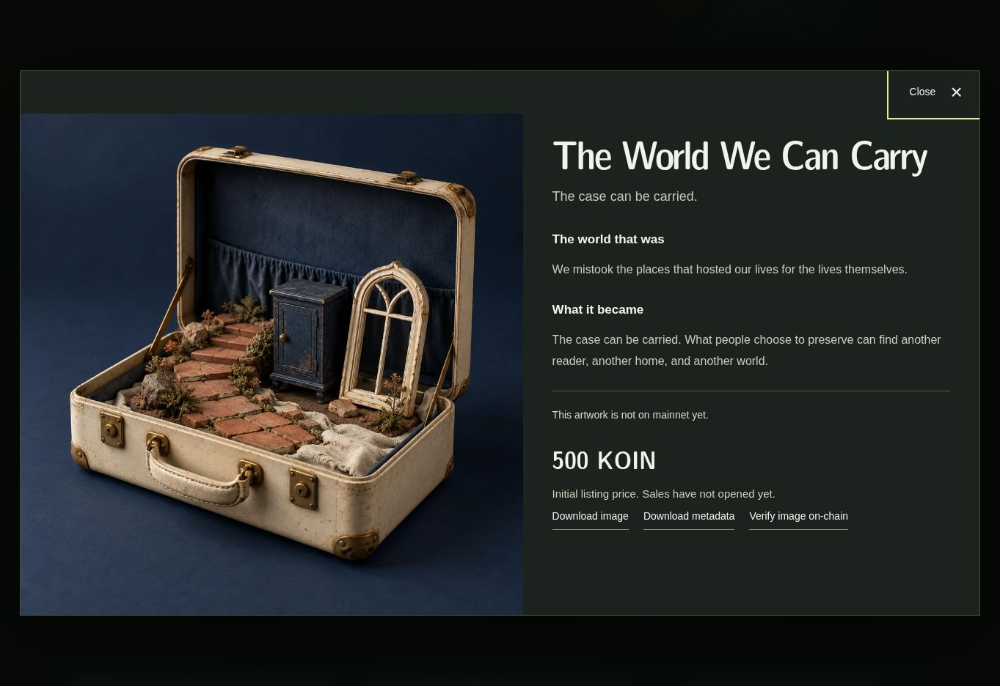

# AFTERLIGHT — The World That Was

A 100-work art collection for Koinos, with images and stories stored on-chain, initial sales at 500 KOIN per work, and an owner resale marketplace.

**Built and locally verified; not deployed.** No production wallet has been created or funded. Sales are deliberately disabled. A funded testnet rehearsal is the next step before mainnet launch.



## Included

- 100 distinct final WebP artworks, each below 200,000 bytes, with individual titles, stories, metadata, and SHA-256 fingerprints. The six approved originals are preserved.
- The immersive landing page, searchable collection sales page, owner resale marketplace, wallet collection management, and independent chain reader.
- An immutable artwork archive and a separate upgradeable collection/marketplace contract, with corrected generated ABIs.
- Initial listings at 500 KOIN; owner-priced resales, cancellation, transfer, and atomic KOIN payment. No added marketplace fee or resale royalty.
- Resumable upload tooling, pre-broadcast resource simulation, complete on-chain readback verification, and a separate command to open sales.
- 54 passing compiled-contract tests and 31 passing Node tests. GitHub Actions repeats the build and checks.

## Run locally

Use Node.js 22 or later on Linux, macOS, or WSL.

```sh
npm ci
npm run build
npm run dev
```

Open the local URL printed by Vite. `dist/` is the complete static website and can also be served by any static web host. Building does not deploy contracts, generate a wallet, or open sales. All final artwork is included; no image-generation service or API key is needed.

```sh
npm run test:contract
npm test
npm run verify:assets
npm run launch:plan
```

The protobuf compiler is pinned to version 36.2. Its first build downloads that release from the official Protocol Buffers repository, so a fresh installation needs network access. Application packages are locked in `package-lock.json`.

For Windows testnet deployment using an already funded wallet, follow [the step-by-step Windows guide](docs/TESTNET-WINDOWS.md). The setup uses a hidden local key prompt and checks the funded address before creating any launch files.

## Launch when ready

Read [the complete funding and launch guide](docs/LAUNCH.md). It separates wallet preparation, funding, upload, verification, opening sales, and website publication. Start with a separate testnet working copy. No deployment runs in CI.

The archive becomes permanent; the collection administrator can update ownership and trading code. This distinction is disclosed on the website. Third-party NFT viewers need support for the custom Koinos image reference; the included site reconstructs the bytes directly.

## Project map

| Path | Contents |
| --- | --- |
| `dist/` | Website, all final images, public metadata, ABIs, independent reader |
| `src/` | Wallet, transaction checks, collection and marketplace interface |
| `contracts/assembly/` | Archive and collection/marketplace contract sources |
| `contracts/build/` | Compiled WASM and ABI files |
| `collection/` | Collection source, art briefs, manifest, hashes and upload plan |
| `scripts/` | Build, validation and staged launch commands |
| `docs/` | Architecture, launch guide, validation results and visual previews |
| `dist/testnet/` | Preserved earlier six-work on-chain experiment |

See [architecture and upgrade behavior](docs/ARCHITECTURE.md), [validation results](docs/VALIDATION.md), and [all 100 artwork previews](docs/previews/).

The images were generated with AI under the approved sculptural art direction. They are not represented as human-rendered work. NFT ownership does not grant exclusive access to image data or automatically transfer copyright.
